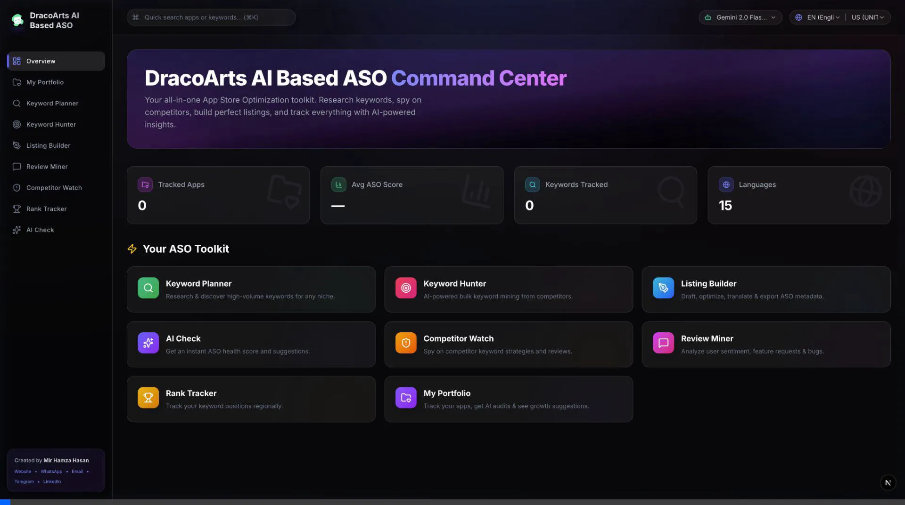
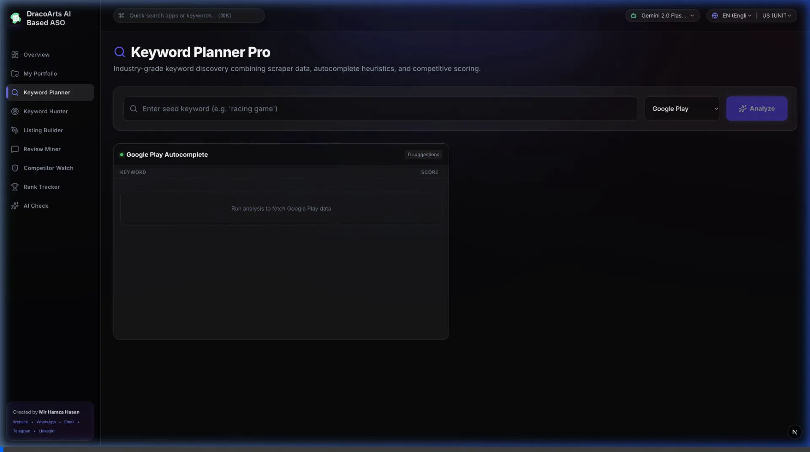
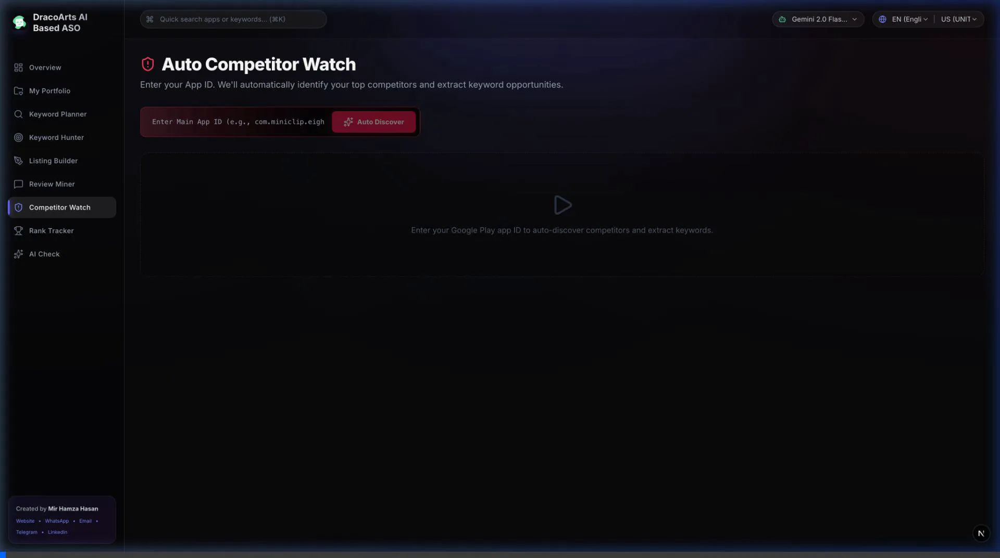
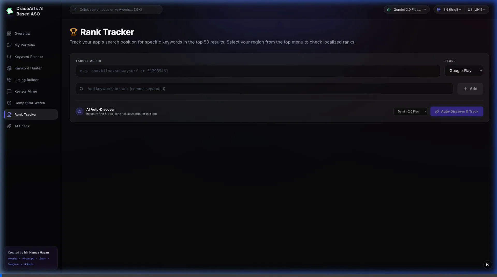
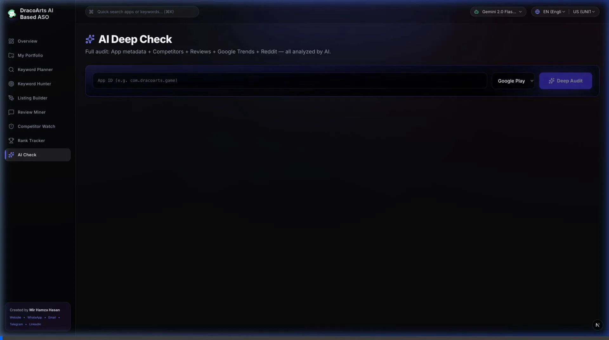

# DracoArts AI-Based ASO 🚀

<p align="center">
  
</p>

An open-source, AI-powered App Store Optimization (ASO) toolkit built with Next.js, Anthropic Claude, OpenAI, DeepSeek, Google Gemini and Ollama. Seamlessly optimize your app metadata, track competitors, find high-value keywords, and boost your app downloads.

> **Note on Animations:** This README includes animated WebP recordings of the tools in action.



## 🌟 Key Features & Tools

DracoArts ASO includes a suite of powerful tools carefully designed to elevate your app's presence in app stores.

### 1. 🔍 Keyword Planner
Discover new keywords, analyze search volume, and find long-tail keyword opportunities for your app.


- **Usage**: Enter a root keyword to generate a comprehensive list of related keywords. Select the best ones to target based on AI-estimated search volume and competition.

### 2. 🎯 Keyword Hunter
Track and extract high-value keywords from top competitors.


- **Usage**: Input competitor app URLs or IDs. The AI will analyze their metadata (titles, subtitles, descriptions) to reverse-engineer their keyword strategy.

### 3. ✍️ Listing Builder
Use AI to generate optimized app titles, subtitles, and descriptions based on target keywords.


- **Usage**: Provide your app's core features and a list of target keywords. The builder will draft multiple variations of app store listings tailored for both the Apple App Store and Google Play Store.

### 4. 💬 Review Miner
Analyze user reviews at scale to uncover feature requests, bug reports, and user sentiment.


- **Usage**: Fetch reviews for your app or a competitor's app. The AI categorizes feedback into actionable insights, helping you prioritize your product roadmap.

### 5. 🛡️ Competitor Watch
Keep an eye on your competitors' metadata changes and keyword strategies.


- **Usage**: Add competitor apps to your watchlist. Get notified and see historical comparisons of their metadata updates.

### 6. 🏆 Rank Tracker
Track your app's ranking for specific keywords over time.


- **Usage**: Add your app and target keywords. The tool will monitor your ranking performance and visualize the trends on a dashboard.

### 7. ✨ AI Check
Run automated AI-driven health checks on your app listing to get actionable recommendations.


- **Usage**: Enter your app's URL. The AI evaluates your current listing against ASO best practices and provides a detailed optimization score with improvement suggestions.

### 8. 💼 My Portfolio
A dedicated space to manage and showcase your optimized app listings.

## 🛠️ Tech Stack
- **Framework**: Next.js 16 (App Router)
- **Styling**: Tailwind CSS, Lucide React
- **AI Integration**: Anthropic SDK, Google GenAI, OpenAI, DeepSeek
- **Local LLM Support**: Ollama
- **Data Fetching**: App Store Scraper, Google Play Scraper, Google Trends API

## 🚀 Getting Started

### Prerequisites
- Node.js 18+
- API Keys for one or more supported AI models (OpenAI, Anthropic Claude, Google Gemini, DeepSeek).
- (Optional) Ollama installed for local LLM usage.

### Installation

1. **Clone the repository:**
   ```bash
   git clone https://github.com/yourusername/draco-arts-aso.git
   cd draco-arts-aso
   ```

2. **Install dependencies:**
   ```bash
   npm install
   # or yarn install / pnpm install / bun install
   ```

3. **Environment Setup:**
   Copy the example environment file and add your API keys.
   ```bash
   cp .env.example .env
   ```
   Open `.env` and configure your preferred AI provider:
   ```env
   # Cloud-based LLMs
   GEMINI_API_KEY="your_google_ai_studio_key_here"
   OPENAI_API_KEY="your_openai_api_key_here"
   ANTHROPIC_API_KEY="your_anthropic_api_key_here"
   DEEPSEEK_API_KEY="your_deepseek_api_key_here"
   
   # Local LLM (Ollama)
   OLLAMA_URL="http://127.0.0.1:11434/api/generate"
   ```

4. **Run the development server:**
   ```bash
   npm run dev
   ```
   Open [http://localhost:3000](http://localhost:3000) with your browser to explore the DracoArts ASO toolkit!

## 🤝 Contributing
Contributions are what make the open-source community such an amazing place to learn, inspire, and create. Any contributions you make are **greatly appreciated**.

1. Fork the Project
2. Create your Feature Branch (`git checkout -b feature/AmazingFeature`)
3. Commit your Changes (`git commit -m 'Add some AmazingFeature'`)
4. Push to the Branch (`git push origin feature/AmazingFeature`)
5. Open a Pull Request

## 👨‍💻 Author
**Mir Hamza Hasan**
- **Website**: [https://mirhamzahasan.com](https://mirhamzahasan.com)
- **WhatsApp**: [+971569415953](https://wa.me/971569415953)
- **Telegram**: [@mirhamzahasan](https://t.me/mirhamzahasan)
- **Email**: [mirhamzahasan@gmail.com](mailto:mirhamzahasan@gmail.com)
- **LinkedIn**: [https://www.linkedin.com/in/mirhamzahasan/](https://www.linkedin.com/in/mirhamzahasan/)

> **🚀 Looking for the Pro Version?**  
> If you are interested in an advanced, feature-rich **Pro Version** of DracoArts AI-Based ASO, please feel free to contact me directly using any of the methods above!

## 📄 License
Distributed under the MIT License. See `LICENSE` for more information.
